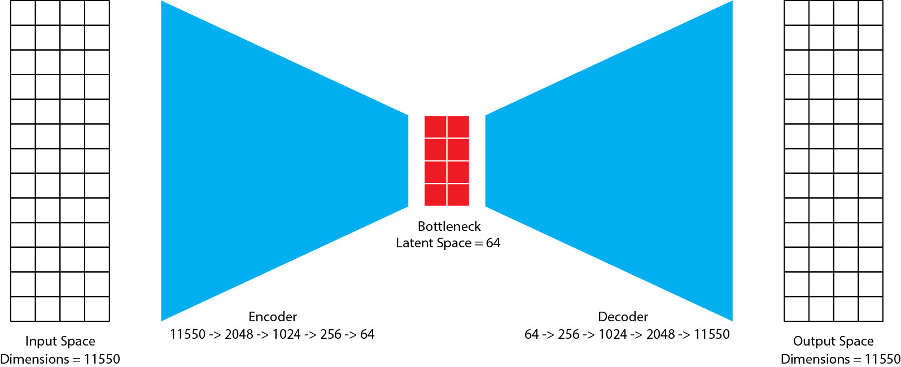

## 3d-voxel-autoencoder
The goal of this project is to create a 3D voxel based autoencoder that can be used to compress
sparse 3D voxel data into a lower dimensional space and then reconstruct the original data from
the compressed representation. This lower dimensional latent space could be used for reinforcement
learning tasks where the state space is too large to be handled by the agent.



> This is an experimental project and is not intended to be used in production.

## Setup
### Install dependencies
install default dependencies
```bash
pip install -r requirements.txt
```

Install pytorch for your system from [pytorch.org](https://pytorch.org/get-started/locally/).
It is highly recommended to install the GPU version of pytorch if you have a compatible GPU.
Otherwise, the CPU version will work just fine but will be much slower.

## Data
The data used for this project is programatically generated using the `generate_data.gh` grasshopper
script. It is recommended to generate 2000 or more samples for training the autoencoder. You can 
tweak the parameters in the grasshopper script to generate different types of data.

## Training
To train the autoencoder, first make sure the data is generated and saved in the `data/raw` directory.
Then run the following command:
```bash
python AE_train.py
```

## Evaluation
To evaluate the autoencoder, run the following command:
```bash
python AE_inference.py
```
The output will be generated in the `output/inference` directory.
Load the output in grasshopper using the `evaluate.gh` script and visualize the results.

## Result
I found that the `VAE` does not work well with this data. 
The `AE_conv` model works the best.
